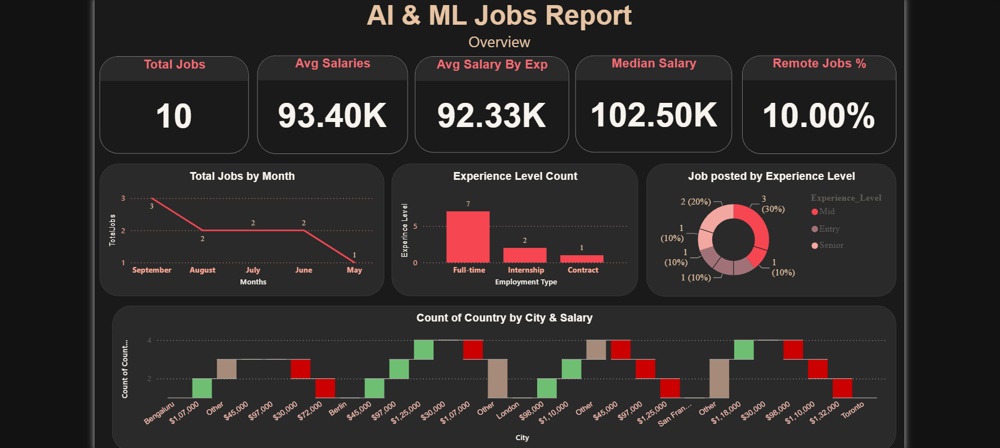
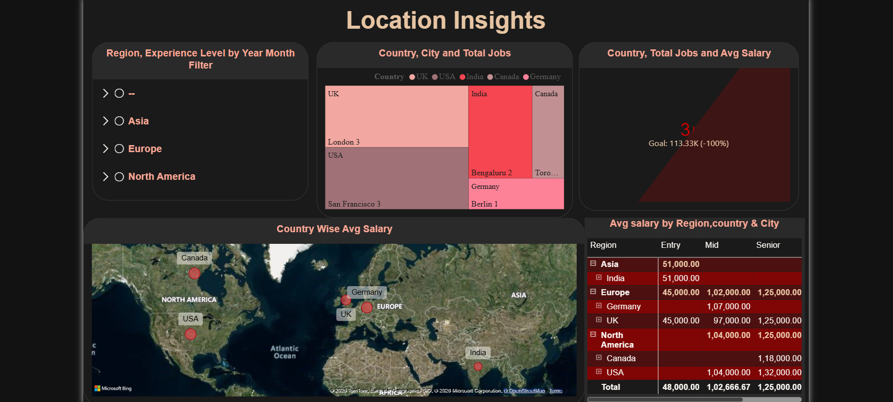
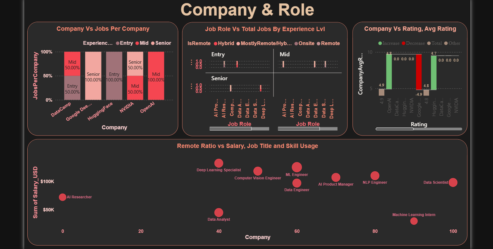
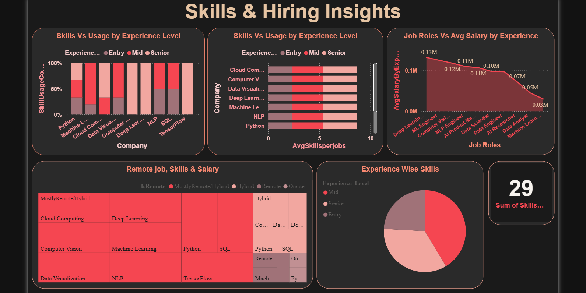

# AI & ML Jobs Analytics Dashboard | Power BI

An interactive **Power BI analytics project** for exploring AI/ML job opportunities across roles, companies, locations, salaries, experience levels, employment types, remote-work ratios, and technical skills.

> **Portfolio note:** This project uses a compact, curated dataset for demonstrating Power BI data modeling, DAX-driven KPIs, interactive reporting, and business-oriented storytelling. It should be treated as a **portfolio / learning project**, not as a statistically representative study of the global AI/ML job market.

---

## Dashboard Overview

The report is organized into four analytical pages:

| Page | Purpose | Key Analysis |
|---|---|---|
| **Overview** | Executive snapshot of the AI/ML job landscape | Total jobs, average salary, median salary, remote-work indicator, salary by experience, job trends, employment mix, and salary distribution |
| **Location Insights** | Geographic comparison | Country-level job volume, average salary, regional filters, city/country breakdown |
| **Company & Role** | Employer and role analysis | Jobs by company, experience mix, job titles, company ratings, salary/remote/skill relationships |
| **Skills & Hiring Insights** | Skills demand and hiring patterns | Skill usage, skills per job, experience/remote segmentation, salary by role/experience |

---

## Business Questions Answered

This dashboard is designed to help answer questions such as:

- What is the overall salary level across the listed AI/ML jobs?
- How do salaries differ by experience level and job role?
- Which countries and cities have the strongest job opportunities in the dataset?
- Which companies offer the highest average compensation?
- Which technical skills appear most frequently across job postings?
- How does remote-work ratio vary across roles and employers?
- What is the mix of full-time, internship, and contract opportunities?

---

## Key KPIs & Findings

Based on the supplied dataset and the report design:

| KPI / Insight | Result |
|---|---:|
| Total jobs | **10** |
| Average salary | **$93,400** |
| Median salary | **$102,500** |
| Salary range | **$30,000 – $132,000** |
| Average remote ratio | **59%** |
| Full-time roles | **7 / 10** |
| Internship roles | **2 / 10** |
| Contract roles | **1 / 10** |
| Mid-level roles | **4 / 10** |
| Senior roles | **3 / 10** |
| Entry-level roles | **3 / 10** |
| Most common skill | **Python (9 job-skill links)** |

### Salary by Experience

| Experience | Average Salary |
|---|---:|
| Senior | **$125,000** |
| Mid | **$103,000** |
| Entry | **$49,000** |

### Highest Average Salary by Company

| Company | Jobs | Avg. Salary | Rating |
|---|---:|---:|---:|
| Google DeepMind | 2 | **$121,500** | 4.9 |
| NVIDIA | 2 | **$121,000** | 4.6 |
| OpenAI | 2 | **$102,500** | 4.8 |
| DataCamp | 2 | **$71,000** | 4.5 |
| HuggingFace | 2 | **$51,000** | 4.7 |

### Most Frequently Used Skills

| Skill | Job-Skill Links |
|---|---:|
| Python | **9** |
| Machine Learning | **5** |
| Cloud Computing | **3** |
| Data Visualization | **3** |
| Computer Vision | **2** |
| Deep Learning | **2** |
| NLP | **2** |
| SQL | **2** |
| TensorFlow | **1** |

> The skill counts represent occurrences in the supplied job-skill mapping, not a percentage of all jobs.

---

## Data Model

The Power BI report follows a dimensional modeling approach with fact and dimension tables.

```text
                    ┌─────────────────┐
                    │  Dim_Companies  │
                    └────────┬────────┘
                             │
                             │
┌────────────────┐     ┌─────▼───────┐     ┌────────────────┐
│  Dim_Locations │────►│  Fact_Jobs  │◄────│    Dim_Date    │
└────────────────┘     └─────┬───────┘     └────────────────┘
                             │
                             │ Job_ID
                             ▼
                    ┌──────────────────┐
                    │ Fact_Job_Skills  │
                    └────────┬─────────┘
                             │
                             ▼
                    ┌─────────────────┐
                    │    Dim_Skills   │
                    └─────────────────┘
```

### Core Tables

- **Fact_Jobs** — job-level attributes such as title, experience, employment type, remote ratio, salary, posting date, company and location.
- **Fact_Job_Skills** — bridge/fact table mapping jobs to their associated skills.
- **Dim_Companies** — company name, size, industry, and rating.
- **Dim_Locations** — city, country, and region.
- **Dim_Skills** — skill master list.
- **Dim_Date** — date/calendar analysis used for time-based reporting.

---

## Power BI Techniques Demonstrated

- Data modeling with fact and dimension tables
- Relationship-driven filtering
- DAX measures / calculated metrics
- KPI cards
- Line, bar, column, donut, pie, treemap, waterfall, scatter, map, KPI, slicer, and matrix visuals
- Interactive slicers and cross-filtering
- Time-based job posting analysis
- Salary benchmarking
- Geographic analysis
- Skill-demand analysis
- Executive dashboard design and storytelling

### Report Measures / Metrics Visible in the Model

Examples include:

- `TotalJobs`
- `AVG_Salary`
- `MedianSalary`
- `RemoteJob%`
- `AvgSalaryByExperience`
- `AvgSalaryByCountry`
- `JobsPerCompany`
- `CompanyAvgRating`
- `SkillsCount`
- `SkillUsageCount`
- `Seniority_Rank`

---

## Dataset

The repository contains the source CSV files used for the dashboard:

```text
data/
├── Companies.csv
├── Jobs.csv
├── Job_Skills.csv
├── Locations.csv
└── Skills.csv
```

### Dataset size

- **10** job records
- **5** companies
- **5** locations
- **10** skills
- **29** job-skill relationships

---

## Repository Structure

Recommended GitHub structure:

```text
AI-ML-Jobs-PowerBI/
│
├── README.md
├── .gitignore
├── dashboard/
│   └── JobAnalysis.pbix
├── data/
│   ├── Companies.csv
│   ├── Jobs.csv
│   ├── Job_Skills.csv
│   ├── Locations.csv
│   └── Skills.csv
├── screenshots/
│   ├── overview.png
│   ├── location-insights.png
│   ├── company-role.png
│   └── skills-hiring.png
└── docs/
    └── data-model.png
```

---

## How to Use

### 1. Clone the repository

```bash
git clone https://github.com/Manassahu01/ai-ml-jobs-powerbi.git
cd AI-ML-Jobs-PowerBI
```

### 2. Open the Power BI file

Open:

```text
dashboaed/JobAnalysis.pbix
```

Use **Microsoft Power BI Desktop** to explore the report, model, relationships, measures, filters, and visuals.

### 3. Review the source data

The CSV files are stored in the `data/` folder so that another user can understand and reproduce the data layer more easily.

---

## Dashboard Screenshots

Add exported screenshots from Power BI here after pushing the project to GitHub.

### Overview



### Location Insights



### Company & Role



### Skills & Hiring Insights



---

## Skills Demonstrated

**Power BI:** Dashboard Development, Data Modeling, DAX, Interactive Reporting, KPI Design, Data Visualization

**Analytics:** Salary Analysis, Geographic Analysis, Hiring Trends, Skill Demand Analysis, Workforce Segmentation

**Data:** CSV Data Integration, Relational Modeling, Fact/Dimension Design, Data Preparation

**Business:** KPI Definition, Insight Generation, Executive Reporting, Decision Support

---

## Portfolio Value

This project demonstrates the ability to move from **raw structured data → analytical model → DAX metrics → interactive dashboard → business insights**.

That end-to-end workflow is the main portfolio value of the project.

---

## Future Improvements

To evolve this into a stronger production-style portfolio project:

1. Expand the dataset to hundreds/thousands of real or clearly licensed job records.
2. Add a dedicated **Data Preparation / Power Query** section documenting cleaning and transformations.
3. Add a proper **Date table** with Year, Quarter, Month, Month Number, and Year-Month sorting.
4. Add measures for YoY job growth, salary percentiles, remote-work segmentation, and skill penetration.
5. Add drill-through pages for **Company**, **Role**, and **Skill** profiles.
6. Add data-quality checks and documentation for assumptions.
7. Publish a Power BI Service version or a static preview alongside the `.pbix` file.

---

## Author

**Manas Sahu**  
Data Analytics / Business Intelligence Portfolio

---

## Disclaimer

This repository is intended for **educational and portfolio demonstration purposes**. The included dataset is compact and curated; conclusions should not be interpreted as representative of the entire AI/ML employment market.
